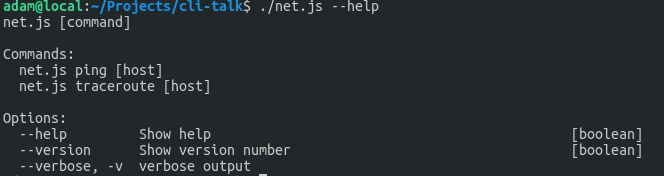
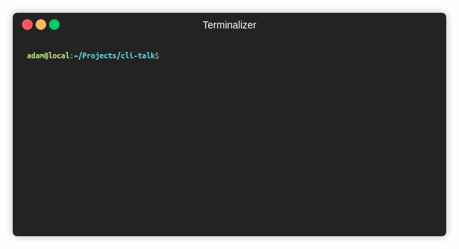

class: center, middle, headline-box, headline-light
background-image: url(images/sneaky-elbow-324446-unsplash.jpg)
background-size: cover

# Do It Yourself:<br>Command Line Tools

---

class: center, middle, headline-light
background-image: url(images/chuttersnap-1178065-unsplash.jpg)
background-size: cover

# We Love the Terminal

---

# When to write your own CLI tool

- Solve repetitive tasks
- Pipe with standard GNU/Unix tools: cat, zcat, awk, grep
- One-off project setup
- Interacting with APIs (upload/download content, backups)
- Commands to execute during CI/CD
- Generating reports
- etc.

---

# Examples

- `serve .`
- `minify-images --out-dir=dist-images images/*`
- `DRY_RUN=true create-backup --table products --upload s3://backups-bucket/products-2019-03-07-23-48-24`
- `cat access.log | awk '$3 ~ /magic/ {print $4 " " \$5}' | generate-magic-report`
- `npx -p Scout24/project-setup scout24init`

---

# Requirements for CLI tools

- Easy to install
- Parse arguments
- Show help and how-to-use information
- Read user input
- Produce result (output)
- Pipe with other CLI tools
- Use environment variables
- Perform magic tricks

---

class: center, middle, headline-light
background-image: url(images/markus-spiske-221494-unsplash.jpg)
background-size: cover

---

# Easy to install

```sh
npm i -g Scout24/project-setup
scout24init
```

OR even without installing anything at all

```sh
npx -p Scout24/project-setup scout24init
```

---

# Parse arguments

```js
#!/usr/bin/env node

// net.js file

const argv = require('yargs')
  .command('ping [host]')
  .command('traceroute [host]')
  .alias('verbose', 'v')
  .describe('v', 'verbose output').argv;

if (argv._.includes('ping')) {
  console.log(`PING ${argv.host}`);
}

if (argv._.includes('traceroute')) {
  console.log(`TRACEROUTE ${argv.host}`);
}
```

---

class: center, middle



We also get `--help` for free.

---

# Showing porgress bar

```js
#!/usr/bin/env node

const ProgressBar = require('progress');

const bar = new ProgressBar(':bar', { total: 40 });
const timer = setInterval(function() {
  bar.tick();
  if (bar.complete) {
    console.log('\ncomplete\n');
    clearInterval(timer);
  }
}, 100);
```

---

class: center, middle



---

# Read user input a.k.a. Inquirer.js

---

```js
#!/usr/bin/env node

const inquirer = require('inquirer');

inquirer
  .prompt([
    { type: 'input', name: 'username', message: 'Username' },
    { type: 'password', name: 'password', message: 'Password' },
    {
      type: 'list',
      name: 'role',
      message: 'Role',
      choices: ['AdminAccess', 'PowerUserAccess', 'ReadOnlyAccess'],
      default: 'ReadOnlyAccess',
    },
    {
      type: 'checkbox',
      name: 'lang',
      message: 'Programming language',
      choices: ['JS', 'TS', 'C#', 'Rust', 'Python', 'Go'],
    },
  ])
  .then(answers => {
    console.log(answers);
  });
```

---

class: center, middle


---

# Links

- Parsing arguments: [yargs](https://github.com/yargs/yargs)
- Fancy user input: [inquirer.js](https://github.com/SBoudrias/Inquirer.js)
- Progress bar: [progress](https://github.com/visionmedia/node-progress)
- Writing colorful messages to the console: [consola](https://github.com/nuxt/consola)

.center[]
